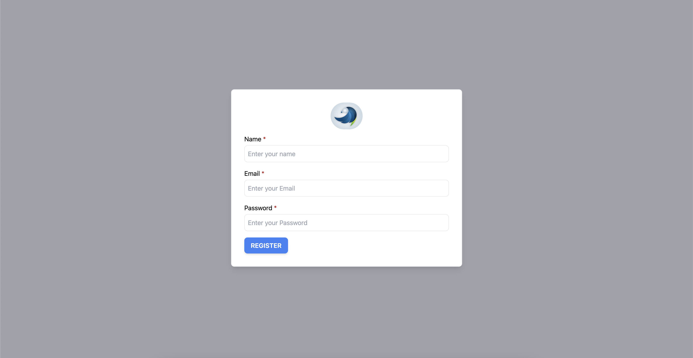

<div>
    
</div>

# Astro Auth Example

This is a Auth example with [prisma](https://www.prisma.io/) and [postgres](https://www.postgresql.org/) using [Astro](https://astro.build/)

## 🛠️ Stack

-  [Astro](https://astro.build/)
-  [React](https://react.dev/)
-  [React Hook Form](https://react-hook-form.com/)
-  [Prisma.io](https://www.prisma.io/docs)
-  [Postgres](https://www.postgresql.org/docs/)
-  [Zod](https://zod.dev/)
-  [docker compose](https://docs.docker.com/compose/)

## Getting Started

1. Install [`docker desktop`](https://docs.docker.com/desktop/install/mac-install/)
2. Install dependencies:

```sh
yarn install
```

3. Set your environment variables (example in `.env.example` file)

4. Start postgres container, seed data and run development server:

```sh
yarn dev:up
```

5. Open [http://localhost:4321](http://localhost:4321) with your browser.

## 🧞 Commands

All commands are run from the root of the project, from a terminal:

| Command             | Action                                                                             |
| :------------------ | :--------------------------------------------------------------------------------- |
| `yarn install`      | Installs dependencies                                                              |
| `yarn run dev:up`   | Start a postgres db with seed data and starts local dev server at `localhost:4321` |
| `yarn run dev`      | Starts local dev server at `localhost:4321`                                        |
| `yarn run dev:down` | Stop local dev server and remove postgres db                                       |
